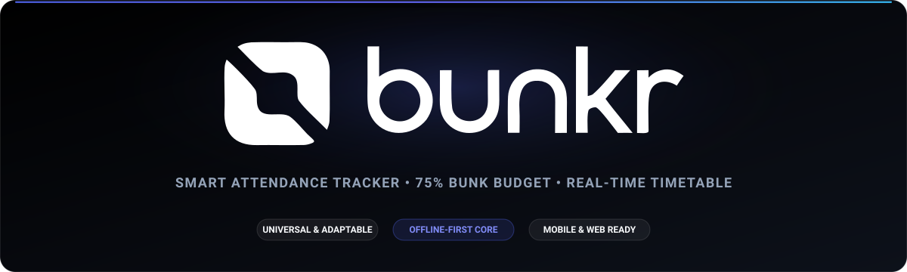
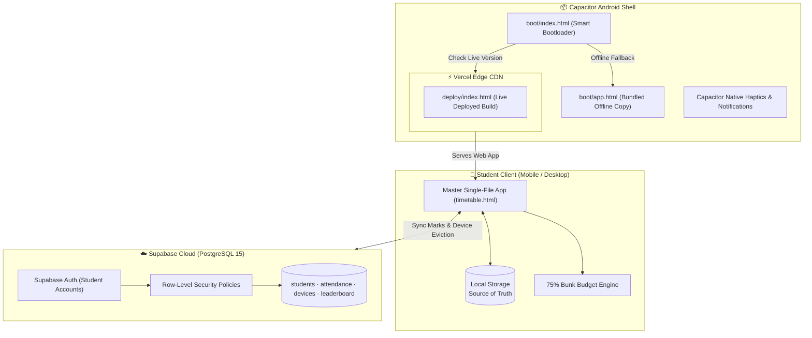

<p align="center">
  
</p>

<p align="center">
  <strong>Next-generation attendance tracker, 75% bunk budget engine, and real-time corridor timetable.</strong><br>
  Built specifically for B.Tech First Year (Sec F, IT-1) at ADGIPS, affiliated with Guru Gobind Singh Indraprastha University (GGSIPU), New Delhi.
</p>

<p align="center">
  <a href="https://deploy-hazel-three-81.vercel.app"></a>
  <a href="https://supabase.com"></a>
  <a href="https://capacitorjs.com"></a>
  <a href="#-architecture--zero-build-philosophy"></a>
  <a href="./LICENSE"></a>
</p>

<p align="center">
  <a href="https://deploy-hazel-three-81.vercel.app">🚀 <strong>Launch Live App</strong></a> •
  <a href="#-key-features">✨ <strong>Features</strong></a> •
  <a href="#-system-architecture">🏗️ <strong>Architecture</strong></a> •
  <a href="#-project-structure">📂 <strong>Project Structure</strong></a> •
  <a href="#-supabase-database-setup">🗄️ <strong>Database Setup</strong></a> •
  <a href="#-mobile-app--local-development">🛠️ <strong>Development</strong></a>
</p>

---

## ⚡ Why Bunkr?

In college life, students face two recurring high-stakes questions every day:

1. **The Corridor Scene (10 seconds):** Standing outside a lecture hall with a backpack on and one hand on your phone — *"What class do I have right now, which lab is batch F1 in, and when does it end?"*
2. **The Decision Scene (Mathematical certainty):** Sitting at a desk deciding whether to skip a lecture — *"Am I safely above the mandatory 75% attendance threshold? Exactly how many lectures can I miss before being barred from exams?"*

**Bunkr** was created to answer both questions in 2 seconds flat with zero friction. It carries the actual section schedule, real subject codes, faculty assignments, practical batch splits (F1 / F2), and the official GGSIPU 2026 academic holiday order.

---

## ✨ Key Features

| Feature | Description |
|---|---|
| 🎯 **Live Corridor Radar** | Real-time ticker reporting the active subject, current classroom (**Room 2311**), time remaining in the period, upcoming lecture, and scheduled lunch breaks (11:00 AM – 11:30 AM). |
| 🧮 **75% Bunk Budget Engine** | Exact term-wide attendance math. Computes your **Bunk Budget** (safe absences remaining while staying $\ge 75\%$), mandatory classes, attendance ceiling, and interactive leave simulation. |
| 🔀 **Smart Batch Awareness** | Instant toggle between practical lab batches **F1** and **F2** with persistent memory in `localStorage`. |
| 🌴 **GGSIPU 2026 Academic Calendar** | Complete official holiday calendar distinguishing **Gazetted** holidays (institute closed) from **Restricted** holidays (optional leaves). |
| 🏆 **Verified Roster & Leaderboard** | Claim your spot on the official 60-student class roster, monitor section attendance rankings, and connect with peers. |
| 🔒 **Single-Device Session Lock** | Automatic multi-device detection. If an account signs in from another phone, previous sessions are evicted securely via Supabase RPC. |
| 📶 **Offline-First & Zero-Build** | 100% functional without an internet connection. Stored locally first, with background cloud backup whenever connectivity is present. |
| 📱 **Hybrid Android APK (Capacitor)** | Native Android container with an intelligent dynamic bootloader: boots the latest remote Vercel build, with instant fallback to a bundled offline copy. |
| 🖤 **Pitch Black OLED UI** | Pure `#000000` AMOLED styling with frosted glassmorphism, fluid micro-interactions, and soft native haptics. |

---

## 🏗️ System Architecture

Bunkr adopts a **zero-build, single-file core** paired with an offline-first hybrid shell:



### The Zero-Build Philosophy
- The master client application lives in [`timetable.html`](./timetable.html) — markup, stylesheets, schedules, and algorithms in a single, highly-optimized file.
- It requires no bundler, no transpilation, no framework, and no `node_modules` to render.
- Can be opened directly from disk (`file://`), sent over WhatsApp, or served on any static host.

---

## 📂 Project Structure

```text
├── android/                    # Capacitor Android Studio native project
│   ├── app/                    # Native Android source, manifests & gradle
│   └── build.gradle            # Native build configuration
├── assets/                     # Brand assets and visual media
│   ├── bunkr-banner.svg        # Repository showcase banner
│   ├── bunkr-icon.svg          # High-resolution vector emblem
│   ├── bunkr-logo.svg          # Vector brand wordmark & mark
│   └── favicon.svg             # Adaptive squircle favicon
├── boot/                       # Capacitor web directory & dynamic bootloader
│   ├── index.html              # Dynamic OTA remote loader & fallback router
│   ├── app.html                # Pre-packaged offline fallback app
│   └── favicon.svg             # Bootloader assets
├── deploy/                     # Static Vercel deployment directory
│   ├── index.html              # Live web app served to production
│   ├── vercel.json             # Cache-control & CORS headers
│   └── _headers                # HTTP header rules
├── docs/                       # Project specifications & design system
│   ├── DESIGN.md               # Color tokens, typography, and UX guidelines
│   ├── PRODUCT.md              # Product specs, academic constraints, & timetable data
│   └── preview-brand.html      # Interactive brand showcase and test tool
├── supabase/                   # Supabase PostgreSQL migrations & schemas
│   ├── 01-students-setup.sql   # Roster schema (60 students) & claim policies
│   ├── 02-attendance-setup.sql # Cloud attendance sync & RLS rules
│   ├── 03-devices-setup.sql    # Single-device session tracking & eviction RPC
│   ├── 04-leaderboard-setup.sql# Section ranking views & leaderboard logic
│   ├── 05-features-setup.sql   # Class representative (CR) roles & cancellations
│   ├── production-reset.sql    # Clean reset script for new semesters
│   └── README.md               # Step-by-step database setup guide
├── capacitor.config.json       # Capacitor configuration (in.adgips.secf)
├── package.json                # Project scripts & Capacitor dependencies
├── timetable.html              # Master application file (Single-file source of truth)
└── README.md                   # Repository documentation
```

---

## 🗄️ Supabase Database Setup

To provision a fresh database instance, run the migration scripts in the [Supabase SQL Editor](https://app.supabase.com) in order:

1. **[`01-students-setup.sql`](./supabase/01-students-setup.sql):** Provisions `public.students` with the 60-student roster for batches F1 & F2, setting up anti-race condition account claiming.
2. **[`02-attendance-setup.sql`](./supabase/02-attendance-setup.sql):** Provisions `public.attendance` cloud sync storage with row-level security.
3. **[`03-devices-setup.sql`](./supabase/03-devices-setup.sql):** Adds `active_device_id` columns and the `claim_device()` function for single-session enforcement.
4. **[`04-leaderboard-setup.sql`](./supabase/04-leaderboard-setup.sql):** Provisions the leaderboard view and section statistics.
5. **[`05-features-setup.sql`](./supabase/05-features-setup.sql):** Adds CR privilege checks and class cancellation boards.

For in-depth explanations of the database architecture, refer to [`supabase/README.md`](./supabase/README.md).

---

## 🛠️ Mobile App & Local Development

### 1. Running the Web App Locally
Because Bunkr is a zero-build application, you can test it directly:
- **Direct in browser:** Simply double-click [`timetable.html`](./timetable.html) or open it via `file://`.
- **With a local web server:**
  ```bash
  npx serve .
  # or
  python3 -m http.server 8080
  ```

### 2. Synchronizing Builds
Whenever edits are made to [`timetable.html`](./timetable.html), synchronize them across the deployment targets:
```bash
npm run prep
```
*This copies `timetable.html` to both `deploy/index.html` (Vercel) and `boot/app.html` (Android offline bundle).*

### 3. Android Development (Capacitor)
To build and run the Android app:

```bash
# Install dependencies
npm install

# Sync web assets with Capacitor Android
npm run sync

# Open project in Android Studio
npm run open

# Build debug APK via Gradle
npm run build
```

---

## 🎨 Design System & Visual Tokens

Bunkr is built upon an intentional design system tailored for low-light college classrooms and outdoors:
- **Primary Dark Background:** Pitch Black `#000000` (zero battery draw on OLED/AMOLED screens).
- **Glassmorphism Layers:** `backdrop-filter: blur(16px)` with subtle `rgba(255, 255, 255, 0.08)` borders.
- **Typography:** Barlow Condensed & Barlow — tabular numbers for high-density, legible timetable grids.
- **Brand Preview:** Explore the design tokens and logos live by viewing [`docs/preview-brand.html`](./docs/preview-brand.html).

---

## 📜 Academic Attribution

- **Institution:** Dr. Akhilesh Das Gupta Institute of Professional Studies (ADGIPS), FC-26 Shastri Park, New Delhi–110056.
- **Affiliation:** Guru Gobind Singh Indraprastha University (GGSIPU), Session 2026–2027.
- **Section:** B.Tech Information Technology, First Year (Sec F, IT-1).
- **Classroom:** Room 2311.

---

## 📄 License

This project is licensed under the [MIT License](./LICENSE).

Built with ❤️ by [Daksh Sharma](https://github.com/DkshByte).
