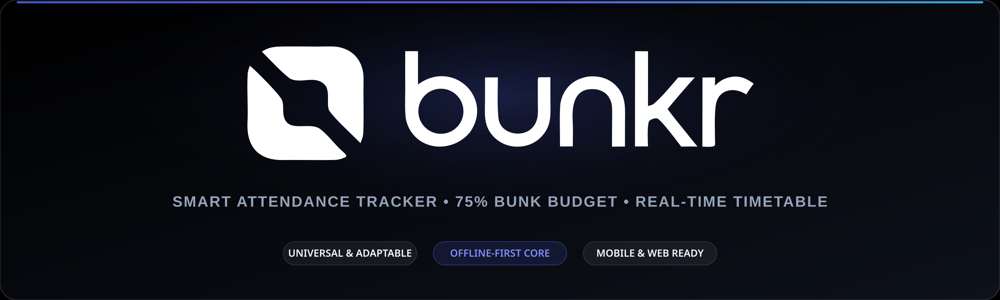
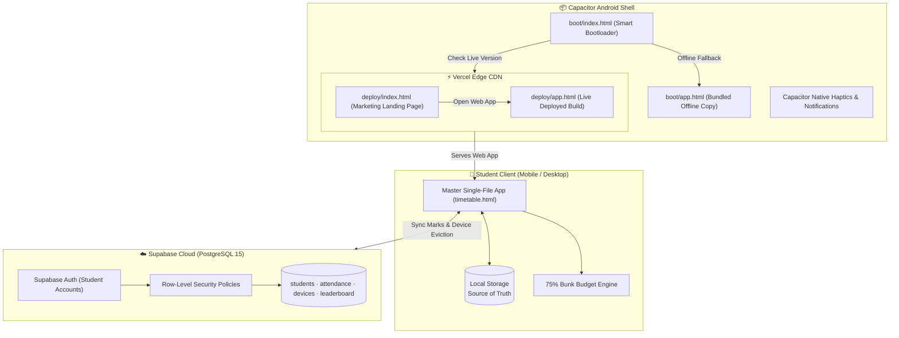

<div align="center">



# Bunkr

**Universal attendance tracker, 75% bunk budget engine, and real-time corridor timetable.**<br>
*A modern, fast, offline-first attendance companion built for college and university students.*

[](https://bunkr.website)
[](https://supabase.com)
[](https://capacitorjs.com)
[](#-architecture--zero-build-philosophy)
[](./LICENSE)

[🚀 **Launch Web App**](https://bunkr.website) •
[✨ **Features**](#-key-features) •
[🏗️ **Architecture**](#-system-architecture) •
[📂 **Structure**](#-project-structure) •
[🗄️ **Database Setup**](#-supabase-database-setup) •
[🛠️ **Development**](#-mobile-app--local-development)

</div>

---

## ⚡ Why Bunkr?

Every student faces two recurring questions throughout the academic semester:

1. **The Corridor Scene (10 seconds):** Standing outside a lecture hall between classes — *"What class is next, is it a lecture or lab, and when does it finish?"*
2. **The Decision Scene (Mathematical certainty):** Deciding whether to skip a lecture — *"Am I safely above the mandatory 75% threshold? Exactly how many lectures can I afford to miss before facing detention?"*

**Bunkr** answers both questions instantly with zero friction. It turns static timetable schedules into an intelligent, interactive command center that computes exact attendance margins, tracks term progress, and works completely offline.

---

## ✨ Key Features

| Feature | Description |
|---|---|
| 🎯 **Live Class Radar** | Real-time ticker reporting the active subject, session type (Lecture vs. Lab), time remaining in the period, upcoming lecture, and scheduled break periods. |
| 🧮 **75% Bunk Budget Engine** | Exact term-wide attendance calculations. Projects your **Bunk Budget** (safe absences remaining while staying $\ge 75\%$), mandatory lectures, attendance ceiling, and leave impact simulator. |
| 🔀 **Multi-Batch Scheduling** | Instant toggle between practical lab batches with persistent preferences saved directly to `localStorage`. |
| 🌴 **Academic Calendar & Closures** | Complete holiday and academic calendar distinguishing **Official Closures** from optional institutional leaves. |
| 🏆 **Roster & Section Leaderboard** | Claim your student account on the class roster, track section attendance rankings, and view classmate profiles. |
| 🔒 **Single-Device Session Lock** | Automatic multi-device detection. If an account signs in from another device, previous sessions are evicted securely via Supabase RPC. |
| 📶 **Offline-First & Zero-Build** | 100% functional without internet connectivity. Records persist locally first, syncing to cloud storage in the background when online. |
| 📱 **Hybrid Android APK (Capacitor)** | Native Android container with an intelligent dynamic bootloader: boots the latest remote web build, with instant fallback to a bundled offline copy. |
| 🖤 **Pitch Black OLED UI** | Pure `#000000` AMOLED styling with frosted glassmorphism, fluid micro-interactions, and soft native haptics. |

---

## 🏗️ System Architecture

Bunkr adopts a **zero-build, single-file core** paired with an offline-first hybrid shell:



### The Zero-Build Philosophy
- The master client application lives in [`timetable.html`](./timetable.html) — markup, styling, schedules, and logic in a single, highly-optimized file.
- It requires no bundler, no transpilation, no framework, and no `node_modules` to render.
- Can be opened directly from disk (`file://`), sent to classmates, or served on any static host.

---

## 📂 Project Structure

```text
├── android/                    # Capacitor Android Studio native project
│   ├── app/                    # Native Android source, manifests & gradle
│   └── build.gradle            # Native build configuration
├── assets/                     # Brand assets and visual media
│   ├── bunkr-banner.png        # Repository showcase banner
│   ├── bunkr-icon.svg          # High-resolution vector emblem
│   ├── bunkr-logo.png          # Vector brand wordmark (retina PNG)
│   ├── bunkr-logo.svg          # Vector brand wordmark (SVG)
│   └── favicon.svg             # Adaptive squircle favicon
├── boot/                       # Capacitor web directory & dynamic bootloader
│   ├── index.html              # Dynamic OTA remote loader & fallback router
│   ├── app.html                # Pre-packaged offline fallback app
│   └── favicon.svg             # Bootloader assets
├── deploy/                     # Static Vercel deployment directory
│   ├── index.html              # Marketing landing page (what people hit first)
│   ├── app.html                # Live web app, linked from the landing page
│   ├── vercel.json             # Cache-control & CORS headers
│   └── _headers                # HTTP header rules
├── docs/                       # Project specifications & design system
│   ├── DESIGN.md               # Color tokens, typography, and UX guidelines
│   ├── PRODUCT.md              # Product specs & timetable architecture
│   └── preview-brand.html      # Interactive brand showcase and test tool
├── supabase/                   # Supabase PostgreSQL migrations & schemas
│   ├── 01-students-setup.sql   # Roster schema & account claiming policies
│   ├── 02-attendance-setup.sql # Cloud attendance sync & RLS rules
│   ├── 03-devices-setup.sql    # Single-device session tracking & eviction RPC
│   ├── 04-leaderboard-setup.sql# Section ranking views & leaderboard logic
│   ├── 05-features-setup.sql   # Role privilege checks & cancellations
│   ├── production-reset.sql    # Clean reset script for new semesters
│   └── README.md               # Step-by-step database setup guide
├── capacitor.config.json       # Capacitor configuration
├── package.json                # Project scripts & Capacitor dependencies
├── timetable.html              # Master application file (Single-file source of truth)
└── README.md                   # Repository documentation
```

---

## 🗄️ Supabase Database Setup

To provision a fresh database instance, run the migration scripts in the [Supabase SQL Editor](https://app.supabase.com) in numerical order:

1. **[`01-students-setup.sql`](./supabase/01-students-setup.sql):** Provisions `public.students` table with class roster accounts and concurrency-safe account claiming.
2. **[`02-attendance-setup.sql`](./supabase/02-attendance-setup.sql):** Provisions `public.attendance` cloud sync storage with row-level security.
3. **[`03-devices-setup.sql`](./supabase/03-devices-setup.sql):** Adds `active_device_id` columns and the `claim_device()` function for single-session enforcement.
4. **[`04-leaderboard-setup.sql`](./supabase/04-leaderboard-setup.sql):** Provisions the leaderboard view and section statistics.
5. **[`05-features-setup.sql`](./supabase/05-features-setup.sql):** Adds role privilege checks and class cancellation boards.

For in-depth explanations of the database architecture, refer to [`supabase/README.md`](./supabase/README.md).

---

## 🛠️ Mobile App & Local Development

### 1. Running the Web App Locally
Because Bunkr is a zero-build application, you can test it directly:
- **Direct in browser:** Open [`timetable.html`](./timetable.html) directly via `file://`.
- **With a local web server:**
  ```bash
  npx serve .
  # or
  python3 -m http.server 8080
  ```

### 2. Synchronizing Builds
Whenever edits are made to [`timetable.html`](./timetable.html), synchronize them across the deployment targets:
```bash
npm run prep
```
*This copies `timetable.html` to both `deploy/app.html` (Vercel) and `boot/app.html` (Android offline bundle). `deploy/index.html` is the hand-authored landing page and is never overwritten by this script.*

### 3. Android Development (Capacitor)
To build and run the Android app:

```bash
# Install dependencies
npm install

# Sync web assets with Capacitor Android
npm run sync

# Open project in Android Studio
npm run open

# Build debug APK via Gradle
npm run build
```

---

## 🎨 Design System & Visual Tokens

Bunkr is built upon an intentional design system tailored for low-light classrooms and outdoors:
- **Primary Dark Background:** Pitch Black `#000000` (zero battery draw on OLED/AMOLED screens).
- **Glassmorphism Layers:** `backdrop-filter: blur(16px)` with subtle `rgba(255, 255, 255, 0.08)` borders.
- **Typography:** Blinker — squarish, modern geometric typeface matching the Bunkr brand logo, with tabular numbers for high-density, legible timetable grids.
- **Brand Preview:** Explore the design tokens and logos live by viewing [`docs/preview-brand.html`](./docs/preview-brand.html).

---

## 📄 License

This project is licensed under the [MIT License](./LICENSE).

Built with ❤️ by [Daksh Sharma](https://github.com/DkshByte).
